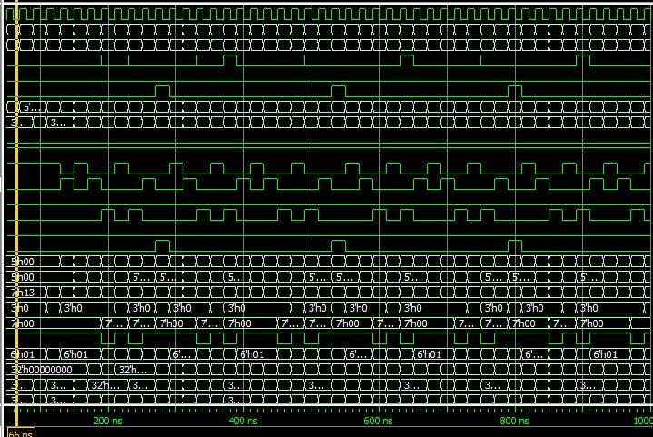
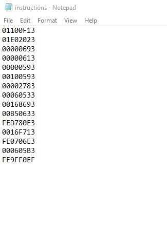
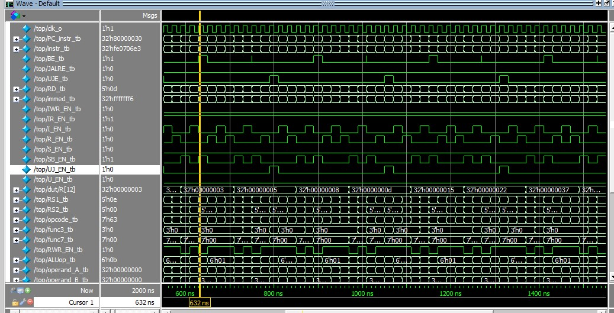

# **RISC-V Single Cycle atomRVCORE**
## Designed by **Rehan Ejaz**

*Hello,
	I am a student of Electrical Engineering in Usman Institute of Technology (Affiliated with NED). I have totally understood riscv Datapath and implemented it on logisim,after that is learned SystemVerilog and implemented it on SystemVerilog.
It is a great acheivement for me looking forward to contribute much more.
It's such a good experience to work on automated stuff.I  enjoy to work on something creative.*

---
---


#### Simulation snap of modelsim
---
---
## How to Run

First of all get started by cloning this repository on your machine.  
```ruby
https://github.com/merledu/atomRVCORE.git 
```
 *Create a instructions.mem file and place the ***hexadecimal*** code of your instructions simulated on ***Venus*** (RISC-V Simulator)
Each instruction's hexadecimal code must be on seperate line as following.These given 15 instructions will generate **fibonacci series***
01100F13
01E02023
00000693
00000613
00000593
00100593
00002783
00060533
00168693
00B50633
FED780E3
0016F713
FE0706E3
000605B3
FE9FF0EF
```
Then simply compile and run simulation by top.sv file uncheck [enable optimization] on modelsim
```

 

--- 

